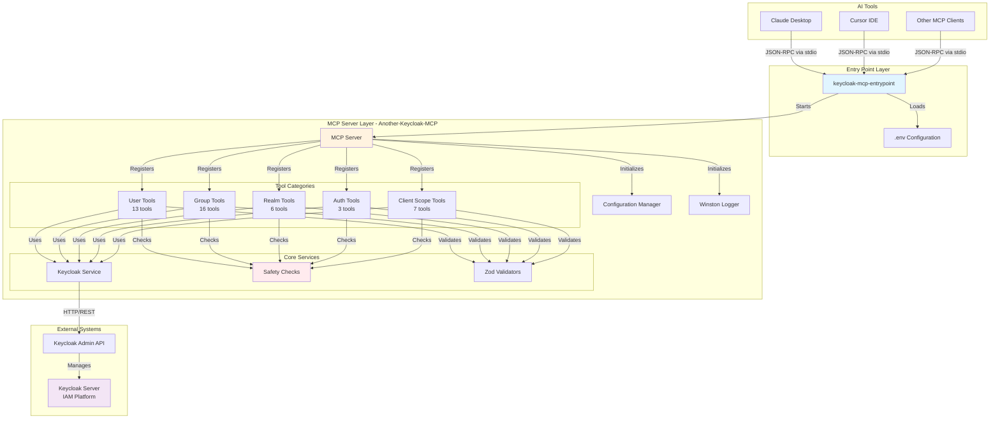
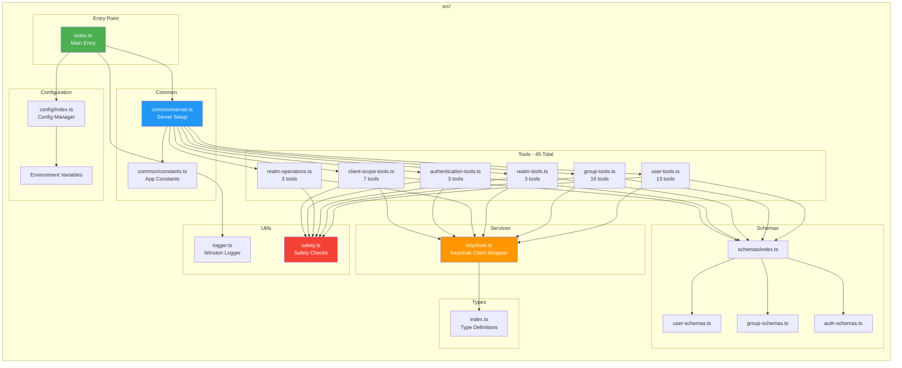
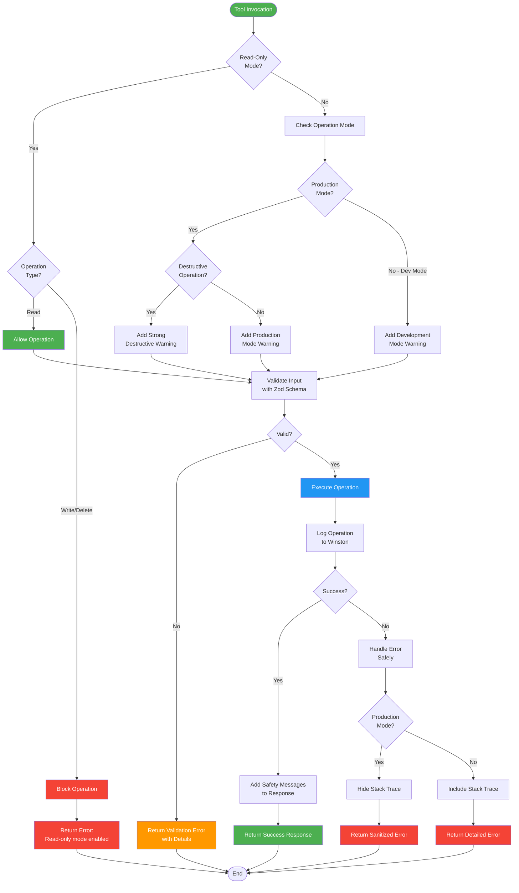
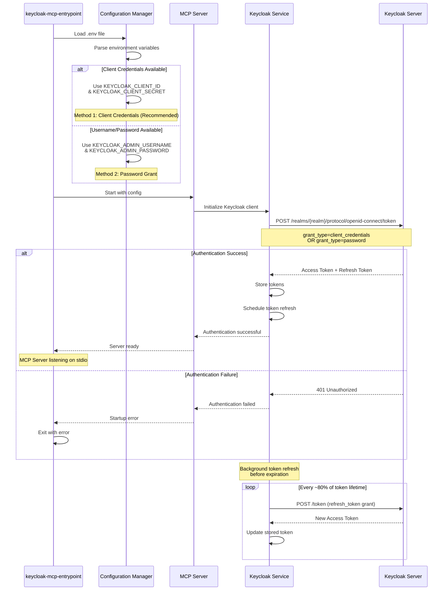
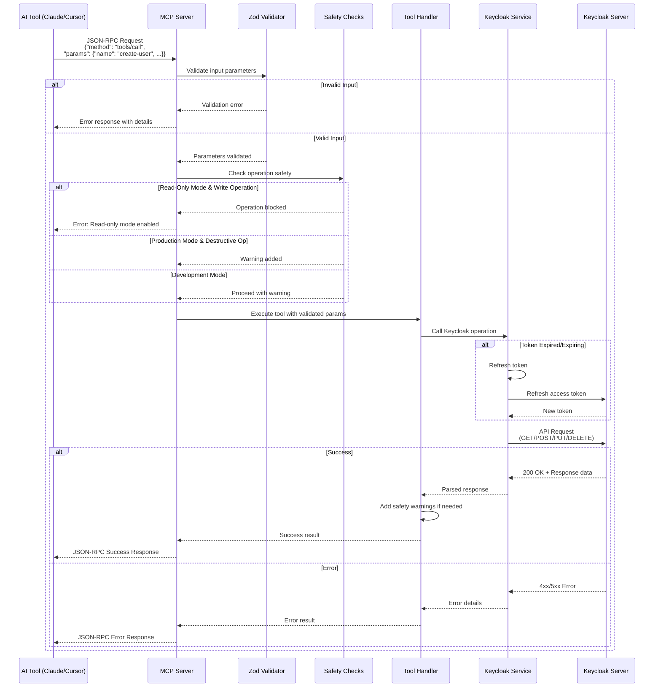

In the evolving landscape of AI-assisted development, the ability to seamlessly integrate AI tools with enterprise systems has become increasingly important. Today, we're exploring a powerful solution that bridges the gap between AI assistants like Cursor and Claude and our beloved Keycloak, the popular open-source Identity and Access Management (IAM) middleware.

## What is the Model Context Protocol (MCP)?

Before diving into the project itself, let's understand what MCP is. The Model Context Protocol is a standardized protocol developed by Anthropic that allows AI assistants to interact with external systems and tools. Think of it as a universal adapter that enables AI models to safely communicate with databases, APIs, file systems, and other services.

MCP servers expose specific tools that AI assistants can invoke, providing a structured and type-safe way for AI to interact with complex systems without directly accessing APIs or databases.

## Introducing Another-Keycloak-MCP (AKC-MCP)

Another-Keycloak-MCP is a MCP server specifically designed for Keycloak IAM.<br />
It provides AI assistants with 45 specialized tools to manage users, groups, realms, authentication flows, and client scopes—all while maintaining strict safety controls and type validation.

### Why Another Keycloak MCP?

While several Keycloak MCP implementations exist, AKC-MCP stands out with:

- **Comprehensive coverage**: 45 tools spanning all major Keycloak management areas
- **Advanced search capabilities**: Multi-field search with exact/fuzzy matching, duplicate detection, and IDP link checking
- **Production-ready safety features**: Multiple operation modes, read-only mode, and destructive operation warnings
- **Full TypeScript implementation**: Strong typing with Zod runtime validation
- **Modern architecture**: Built with the latest Keycloak Admin Client (v26.x) and MCP SDK

## Architecture Overview

### Technology Stack

AKC-MCP is built on a solid foundation of modern JavaScript technologies:

- **Runtime**: Node.js 18+ with ES Modules
- **Language**: TypeScript with strict mode enabled
- **Keycloak Integration**: Official `@keycloak/keycloak-admin-client` v26.x
- **MCP Protocol**: `@modelcontextprotocol/sdk` v1.0+
- **Validation**: Zod schemas for runtime type checking
- **Logging**: Winston for structured logging
- **Build System**: tsup for efficient ESM bundling

### High-Level System Architecture

This diagram shows the overall system architecture and how different components interact.



## Component Architecture

This diagram shows the internal component structure of another-keycloak-mcp.



### Project Structure

The codebase follows a clean, modular architecture:

```
src/
├── common/              # Server setup and constants
├── config/              # Environment-based configuration
├── schemas/             # Zod validation schemas
├── services/            # Keycloak client wrapper
├── tools/               # MCP tool implementations
│   ├── user-tools.ts              (13 tools)
│   ├── group-tools.ts             (16 tools)
│   ├── realm-operations.ts        (3 tools)
│   ├── realm-tools.ts             (3 tools)
│   ├── authentication-tools.ts    (3 tools)
│   └── client-scope-tools.ts      (7 tools)
├── types/               # TypeScript type definitions
└── utils/               # Logger and safety utilities
```

This structure promotes maintainability, with each tool category isolated in its own module and shared utilities centralized for consistency.

## The 45 Tools: A Comprehensive Toolkit

AKC-MCP provides tools across five major categories:

### 1. User Management (13 Tools)

User management tools go beyond basic CRUD operations:

- **search-user**: Multi-field search supporting username, email, firstName, and lastName with both exact and fuzzy matching
- **get-user-details**: Retrieve complete user profiles including custom attributes, group memberships, and IDP links
- **check-multiple-accounts**: Find duplicate accounts sharing the same email address
- **check-user-idp-broker-link**: Verify if a user is linked to an Identity Provider
- **get-user-idp-links**: List all IDP connections for a user
- **list-user-attributes**: Get custom attribute key-value pairs
- **list-user-sessions**: Monitor active user sessions
- **create-user**: Create users with optional temporary passwords
- **update-user**: Modify user information
- **delete-user**: Remove users (with safety warnings)
- **reset-password**: Reset passwords (temporary or permanent)
- **toggle-user-status**: Enable or disable user accounts
- **list-users**: Paginated listing of all realm users

### 2. Group Management (16 Tools)

The most extensive category, offering complete group lifecycle management:

- **list-groups**: List all groups with optional search filtering
- **get-group**: Detailed group information retrieval
- **create-group**: Create top-level groups or subgroups
- **update-group**: Modify group names and attributes
- **delete-group**: Remove groups (with safety checks)
- **add-user-to-group** / **remove-user-from-group**: Membership management
- **list-user-groups**: Get all groups a user belongs to
- **list-group-members**: List users in a specific group
- **search-groups-by-attributes**: Attribute-based group filtering
- **get-group-attributes** / **set-group-attribute** / **delete-group-attribute**: Full attribute CRUD
- **toggle-group-boolean-attribute**: Toggle boolean flags (perfect for feature flags)
- **get-parent-groups**: Navigate up the group hierarchy
- **get-subgroups**: Traverse down with optional recursive traversal

### 3. Realm Operations (6 Tools)

Manage realm configuration and monitoring:

- **list-realms**: Enumerate all available realms
- **get-realm**: Retrieve detailed realm configuration
- **get-realm-stats**: Statistics including user count, group count, client count, and active sessions
- **export-realm**: Export realm configuration with granular control over what to include
- **check-saml-certificates**: Monitor SAML certificate expiration with configurable warning thresholds
- **list-realm-spis**: List custom Service Provider Interfaces

### 4. Authentication Management (3 Tools)

Inspect and manage authentication flows:

- **list-authentication-flows**: List all configured authentication flows
- **get-authentication-flow**: Get detailed flow configuration including execution steps
- **list-required-actions**: View required action configurations

### 5. Client Scope Management (7 Tools)

Full lifecycle management for OIDC and SAML scopes:

- **list-client-scopes**: List all available scopes
- **get-client-scope**: Retrieve scope details with protocol mappers
- **create-client-scope**: Create new OIDC or SAML scopes
- **update-client-scope** / **delete-client-scope**: Modify or remove scopes
- **assign-client-scope** / **remove-client-scope**: Manage scope assignments to clients

## Safety First: Operation Modes and Protections

One of AKC-MCP's standout features is its multi-layered safety system:

### Operation Modes

**Development Mode** (default):

- Write operations allowed with warnings
- Full error stack traces for debugging
- Verbose logging available
- Ideal for learning and experimentation

**Production Mode**:

- Additional confirmations for write operations
- Enhanced warnings for destructive operations
- Sanitized error messages (no sensitive data leakage)
- Recommended for production environments

### Read-Only Mode

When enabled via `READ_ONLY_MODE=true`, all write operations are completely blocked:

- Perfect for auditing and inspection
- Safe for production environments where changes should be prevented
- Ideal for learning Keycloak without risk
- Useful for compliance and security reviews

### Safety Checks

Every write operation includes:

- Operation mode validation
- Read-only mode enforcement
- Destructive operation warnings
- Structured logging
- Safety warning messages in responses

## Safety Check Pipeline

This diagram illustrates the multi-layered safety system.



## The Entry Point: keycloak-mcp-entrypoint

While another-keycloak-mcp provides the core functionality, the keycloak-mcp-entrypoint project serves as a streamlined wrapper designed specifically for AI tool integration.

### What Does It Do?

The entry point is elegantly simple but crucial:

1. **Loads Environment Configuration**: Reads `.env` file for Keycloak connection settings
2. **Displays Startup Banner**: Shows configuration summary (to stderr to avoid interfering with MCP protocol)
3. **Starts the MCP Server**: Imports and launches the another-keycloak-mcp server

Here's the core logic:

```typescript
import { dirname, join } from "path";
import { fileURLToPath } from "url";
import { config } from "dotenv";

// Load environment variables
const __filename = fileURLToPath(import.meta.url);
const __dirname = dirname(__filename);
const envPath = join(__dirname, "..", ".env");

config({ path: envPath });

// Import and run the another-keycloak-mcp server
await import("another-keycloak-mcp");
```

### Why a Separate Entry Point?

The separation provides several benefits:

1. **Simplified Configuration**: Centralized `.env` file management
2. **Easy AI Tool Integration**: Single command/path for Claude Desktop or Cursor
3. **Development Convenience**: No need to rebuild core library for config changes
4. **Flexible Deployment**: Different entry points for different environments

### Authentication Flow

This diagram illustrates how the MCP server authenticates with Keycloak.



### Tool Execution Flow

This diagram shows the complete flow when an AI tool executes a Keycloak operation.



## Getting Started: Installation and Configuration

### Prerequisites

- Node.js 18 or higher
- Keycloak server (v26.4.5 recommended, but compatible with other versions)
- Keycloak admin credentials or service account

### Installation Steps

#### 1. Clone and Install Dependencies

```bash
# Clone both projects
cd /path/to/your/workspace

# Install another-keycloak-mcp
cd another-keycloak-mcp
npm install
npm run build

# Install keycloak-mcp-entrypoint
cd ../keycloak-mcp-entrypoint
npm install
```

#### 2. Configure Environment

Create a `.env` file in the keycloak-mcp-entrypoint directory:

```bash
# Keycloak Server Configuration
# keycloak port may vary depending on your server settings!
# For legacy Keycloak: http://localhost:8082/auth
# For modern Keycloak: http://localhost:8082
KEYCLOAK_URL=http://localhost:8082/auth
KEYCLOAK_REALM=my-realm

# Authentication Method 1 (Recommended): Client Credentials
KEYCLOAK_CLIENT_ID=sso-admin-mcp
KEYCLOAK_CLIENT_SECRET=your-client-secret

# Authentication Method 2 (Alternative): Admin Credentials
# KEYCLOAK_ADMIN_USERNAME=admin
# KEYCLOAK_ADMIN_PASSWORD=admin

# Operation Mode
OPERATION_MODE=development
READ_ONLY_MODE=false

# Transport and Logging
TRANSPORT=stdio
LOG_LEVEL=info
```

<Video
  src="/videos/bridging-ai-and-identity-management-keycloak-mcp/01-client-creation.mov"
  caption="Creating a Keycloak client for MCP authentication"
/>

<Video
  src="/videos/bridging-ai-and-identity-management-keycloak-mcp/02-assigning-realm-mgmt-roles.mov"
  caption="Assigning realm management roles to the client"
/>

### Authentication: Two Methods

#### Method 1: Client Credentials (Recommended)

This is the secure, production-ready approach:

1. Create a dedicated OIDC client in Keycloak (e.g., `sso-admin-mcp`)
2. Enable "Service Accounts" for the client
3. Assign appropriate `realm-management` roles to the service account **(this is needed to allow the client to administrate the realm)**
4. Use the client ID and secret in your configuration

**Advantages**:

- More secure than username/password
- Works when password grant type is disabled
- Better for service accounts
- Supports automatic token refresh

#### Method 2: Username/Password

Uses admin credentials with password grant type. May not work if your Keycloak disables this grant type for security reasons.

### Building the Projects

```bash
# Build another-keycloak-mcp
cd another-keycloak-mcp
npm run build

# Build keycloak-mcp-entrypoint
cd ../keycloak-mcp-entrypoint
npm run build
```

## Integrating with AI Tools

### Claude Desktop Integration

Add this configuration to your Claude Desktop config file:

**macOS**: `~/Library/Application Support/Claude/claude_desktop_config.json`<br />
**Windows**: `%APPDATA%\Claude\claude_desktop_config.json`<br />
**Linux**: `~/.config/Claude/claude_desktop_config.json`

```json
{
  "mcpServers": {
    "keycloak": {
      "command": "node",
      "args": ["/absolute/path/to/keycloak-mcp-entrypoint/dist/index.js"]
    }
  }
}
```

After saving:

1. Completely quit and restart Claude Desktop
2. Open a new conversation
3. Look for the Keycloak tools in the tools panel (hammer icon)
4. Start managing Keycloak with natural language!

### Cursor Integration

Create `.cursor/mcp.json` in your project directory:

```json
{
  "mcpServers": {
    "keycloak": {
      "command": "node",
      "args": ["/absolute/path/to/keycloak-mcp-entrypoint/dist/index.js"]
    }
  }
}
```

Restart Cursor, and you can now ask it to perform Keycloak operations like:

- "List all users in the acme-x realm"
- "Find groups with the feature_flag attribute set to true"
- "Check if user john@example.com has multiple accounts"

<Video
  src="/videos/bridging-ai-and-identity-management-keycloak-mcp/03-entry-point-run.mov"
  caption="Running the MCP entry point"
/>

<Video
  src="/videos/bridging-ai-and-identity-management-keycloak-mcp/04-cursor-mcp-enablement.mov"
  caption="Enabling MCP in Cursor IDE"
/>

## Real-World Use Cases

### 1. Bulk User Management

Quickly identify and resolve duplicate accounts:

```
"Search for all users with email addresses containing @oldcompany.com
and check if any have duplicate accounts"
```

The AI can use `search-user` with fuzzy matching, then `check-multiple-accounts` to identify duplicates.

### 2. Feature Flag Management

Use group boolean attributes as feature flags:

```
"Create a group called 'beta-testers', set a boolean attribute
'beta_features' to true, and add user alice@example.com to it"
```

The AI orchestrates `create-group`, `set-group-attribute`, and `add-user-to-group`.

### 3. Security Auditing

Monitor SAML certificate expiration:

```
"Check all SAML certificates in the production realm and warn me
if any expire within 30 days"
```

Uses `check-saml-certificates` with X.509 certificate parsing via node-forge.

### 4. Realm Configuration Backup

Export realm configurations for backup or migration:

```
"Export the staging realm configuration including all groups,
roles, and clients, but exclude user data"
```

Leverages `export-realm` with granular export options.

### 5. Identity Provider Link Verification

Verify user identity provider connections:

```
"Check if user bob@example.com is linked to the Google identity provider"
```

Uses `check-user-idp-broker-link` to verify federated identity connections.

<Video
  src="/videos/bridging-ai-and-identity-management-keycloak-mcp/05-mcp-prompt.mov"
  caption="Using MCP prompts to interact with Keycloak"
/>

## Advanced Features

### Automatic Token Refresh

One common pain point with long-running sessions is token expiration. AKC-MCP automatically refreshes Keycloak access tokens before they expire, ensuring uninterrupted operation during extended AI interactions.

### Full Type Safety

Every tool input is validated using Zod schemas, providing:

- Runtime type checking
- Clear error messages for invalid inputs
- Automatic type inference for TypeScript consumers
- Protection against malformed requests

### Structured Logging

Winston-based logging provides:

- Different log levels (error, warn, info, debug)
- All logs sent to stderr (avoiding interference with stdio MCP protocol)
- Structured log format for easy parsing
- Safe logging (no credential leakage)

### Multi-Realm Support

Manage multiple Keycloak realms simultaneously:

- Each tool accepts a `realm` parameter
- Switch between development, staging, and production realms
- Configure multiple MCP server instances for different environments

## Performance and Scalability

### Efficient Communication

The MCP protocol uses JSON-RPC over stdio, providing:

- Low latency communication
- Minimal overhead
- Direct process-to-process communication
- No network stack involved for local setups

### Pagination Support

Tools like `list-users` support pagination to handle large datasets efficiently, preventing memory issues and timeouts when dealing with thousands of users.

### Lazy Loading

Group hierarchy traversal tools support optional recursive fetching, allowing you to fetch only what you need rather than entire subtrees.

## Troubleshooting Common Issues

### Connection Issues

If you can't connect to Keycloak:

1. **Use `localhost` instead of `0.0.0.0`**: While `0.0.0.0` works for server binding, HTTP clients need `localhost` or `127.0.0.1`
2. **Check Keycloak version**: Legacy versions (&lt;17) require `/auth` path
3. **Verify Keycloak is running**: Test with `curl http://localhost:8082` (or the default port used for the KC admin console)

### Authentication Failures

If seeing "unauthorized_client" errors:

1. Switch to client credentials authentication (recommended)
2. Enable "Service Accounts" on your Keycloak client
3. Assign proper `realm-management` roles
4. Verify credentials in `.env` file

### AI Tool Integration Issues

If Claude Desktop or Cursor doesn't show tools:

1. Ensure absolute paths in configuration files
2. Verify projects are built (`npm run build`)
3. Completely restart the AI tool (not just reload)
4. Check logs for error messages

## Security Considerations

### Credentials Management

- Never commit `.env` files to version control
- Use environment variables in production
- Rotate credentials regularly
- Prefer client credentials over username/password

### Network Security

- Use HTTPS for production Keycloak instances
- Limit network access to Keycloak servers
- Use VPNs or private networks for sensitive environments
- Enable firewall rules appropriately

### Read-Only Mode for Production

When using AI assistants with production Keycloak:

```bash
OPERATION_MODE=production
READ_ONLY_MODE=true
```

This configuration allows auditing and inspection without any risk of accidental modifications.

## Conclusion

In this article, we walk through a detailed, practical example of integrating the Another-Keycloak MCP server and its companion project, which acts as an entry point for connecting AI tools like Claude and Cursor to Keycloak resources. Even though there are similar community projects out there, the idea here was to build a safer approach to handling resources, including a read-only mode and checks for when we perform write operations.

It provides an initial set of 45 tools with strong safety guarantees, type safety, and production-ready features, it enables organizations to leverage AI for Keycloak management without compromising security or reliability.

The combination of the Model Context Protocol's standardized interface, Keycloak's powerful IAM capabilities, and AI's natural language understanding creates a powerful synergy—making complex identity management tasks as simple as asking a question.

**NOTE**. The projects are available as open-source software under the MIT license, welcoming contributions from the community.

---

**Project Links**:

- another-keycloak-mcp: Core MCP server with 45 Keycloak management tools
- keycloak-mcp-entrypoint: Streamlined entry point for AI tool integration
